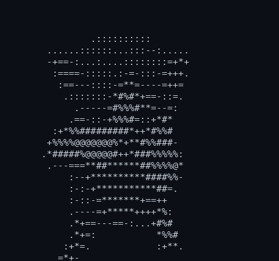

# kicau

A fast, single-binary CLI for X (Twitter) that talks to the private GraphQL API
using your existing session cookies — no developer app, no OAuth dance. Every
tweet it fetches is archived to a local SQLite database and is searchable
offline.

Written in Rust: static binary, quick startup, low memory, no Node/Python
runtime.

<p align="center">
  
</p>

## Install

```sh
cargo install --git https://github.com/gitshrl/kicau.git --locked
```

That builds and drops `kicau` in `~/.cargo/bin` — no clone, no checkout. `--locked`
builds against the committed `Cargo.lock`. Re-run the same command to upgrade.

From a checkout instead:

```sh
cargo build --release
# binary at ./target/release/kicau
```

## Authentication

Run `kicau init` once. It explains where to find your two x.com session cookies,
prompts for them, and writes `~/.kicau/config.toml`. Skip the prompts with Enter
to fill the file in by hand. `kicau config` shows where everything lives.

```toml
# ~/.kicau/config.toml
[credentials]
auth_token = "..."
ct0 = "..."
```

kicau resolves `auth_token` and `ct0` in this order:

1. `--auth-token` / `--ct0` flags
2. `KICAU_AUTH_TOKEN` / `KICAU_CT0`, or `AUTH_TOKEN` / `CT0` environment variables
3. `~/.kicau/config.toml` `[credentials]`

Check what resolved with `kicau check`.

## Usage

```sh
kicau whoami
kicau read 2074208949205881033           # id or full URL
kicau search "rust async"
kicau user ClaudeDevs
kicau home -n 30
kicau tweet "hello from kicau"
kicau tweet "with a picture" --media photo.png --alt "a description"
kicau reply <id-or-url> "nice thread"
kicau like <id> ; kicau retweet <id> ; kicau bookmark <id>
kicau find "loops"                        # offline, over your local archive
kicau mania                               # show a cat dancing in ASCII
```

### Commands

**Read**
`read` · `search` · `mentions` · `replies` · `thread` · `user` · `user-tweets` ·
`home` · `bookmarks` · `list` · `dms` · `dm`

**Write**
`tweet` · `reply` · `delete` · `like`/`unlike` · `retweet`/`unretweet` ·
`bookmark`/`unbookmark` · `follow`/`unfollow` · `blocks` · `mutes` · `upload`

**Local data**
`find` (FTS over archived tweets) · `log` (recent archived) · `sync`
(bookmarks/tweets → SQLite) · `graph` (follow-graph snapshot) · `profiles`
(profile snapshot) · `db stats` · `backup export|import` · `import` (X data export)

**Setup / maintenance**
`init` (create config, prompt for cookies) · `config` (show paths and
credential source) · `whoami` · `check` · `update-query-ids`

Run `kicau <command> --help` for options. Every write supports `--dry-run`.

### Global flags

| Flag | Effect |
|---|---|
| `--json` | machine-readable JSON output |
| `--plain` | no color/emoji, stable text |
| `--no-db` | skip archiving to SQLite |
| `--auth-token` / `--ct0` | override cookies |
| `--timeout <ms>` | request timeout (default 30000) |

## Local storage

- `~/.kicau/kicau.sqlite` — the tweet archive (tweets, profiles, collections,
  follow edges, profile snapshots, DMs), with FTS5 full-text search.
- Reads archive by default; `find` and `log` query it with no network.
- `kicau backup export <dir>` writes each table as git-friendly JSONL;
  `backup import <dir>` restores.

## Files

| Path | Purpose |
|---|---|
| `~/.kicau/config.toml` | all config: credentials and GraphQL query ids |
| `~/.kicau/kicau.sqlite` | local archive |
